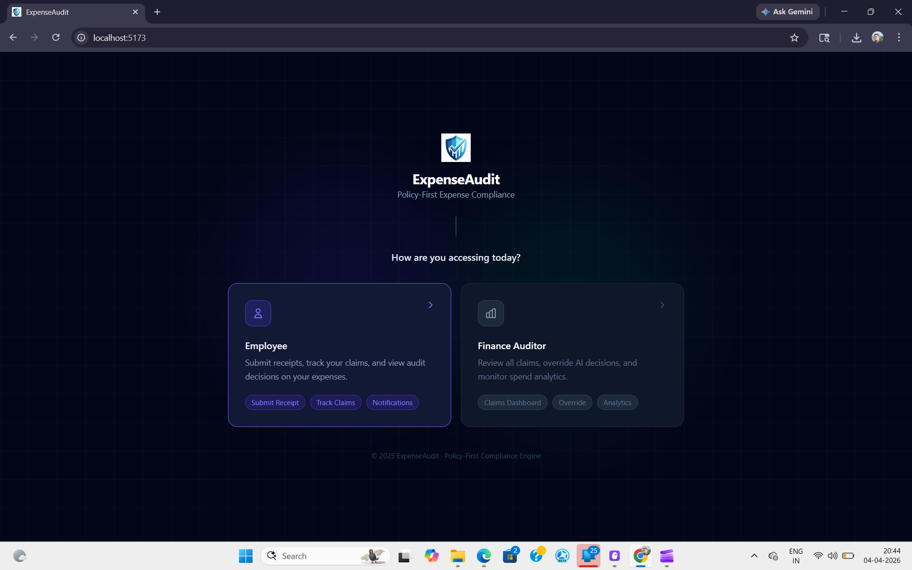
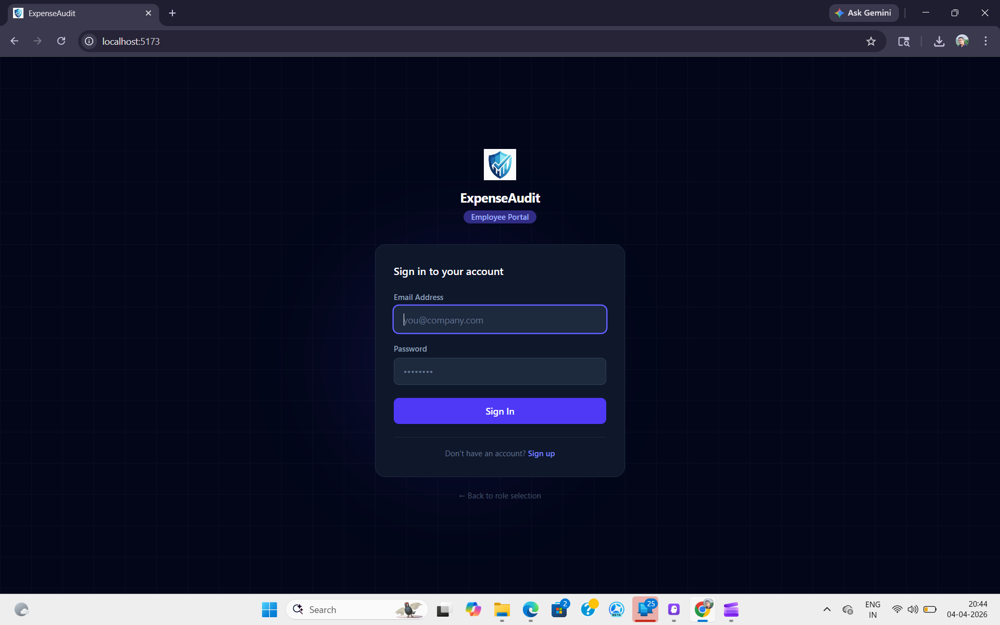
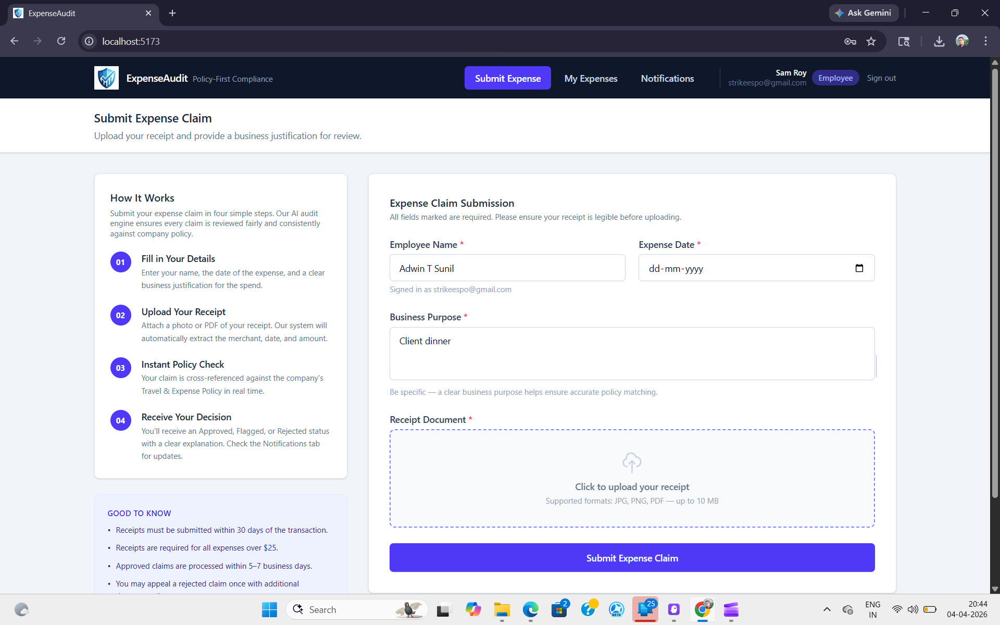
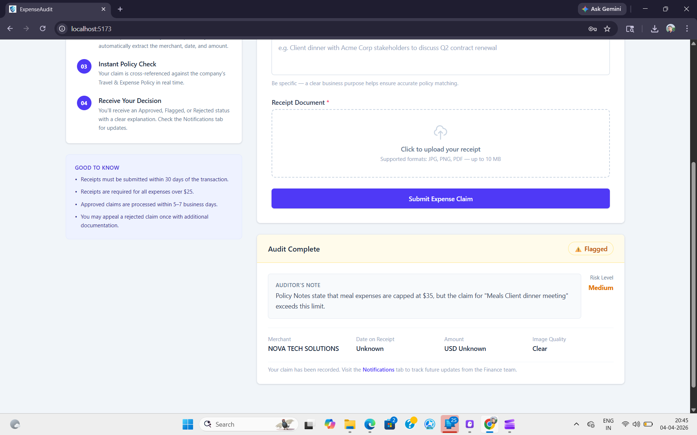
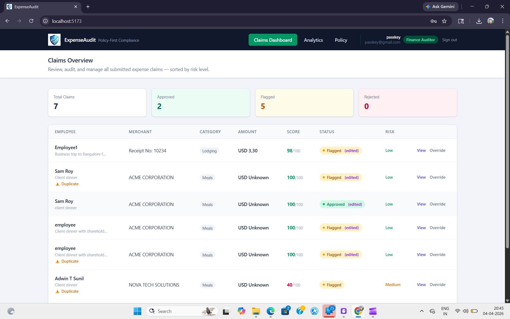
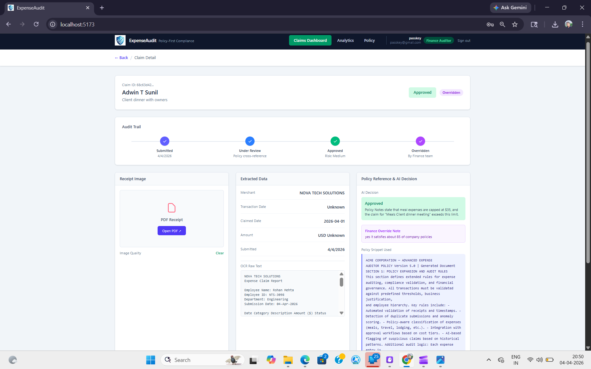
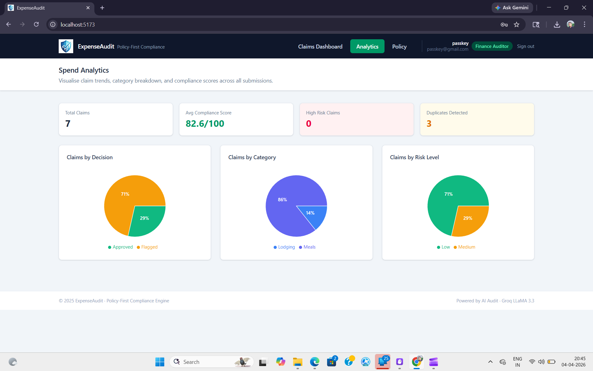
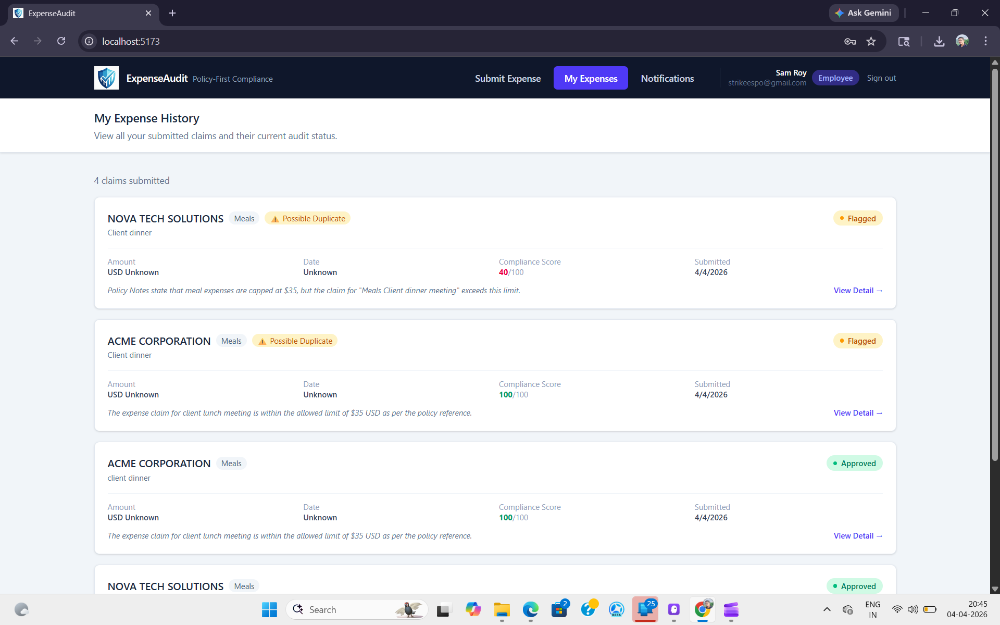
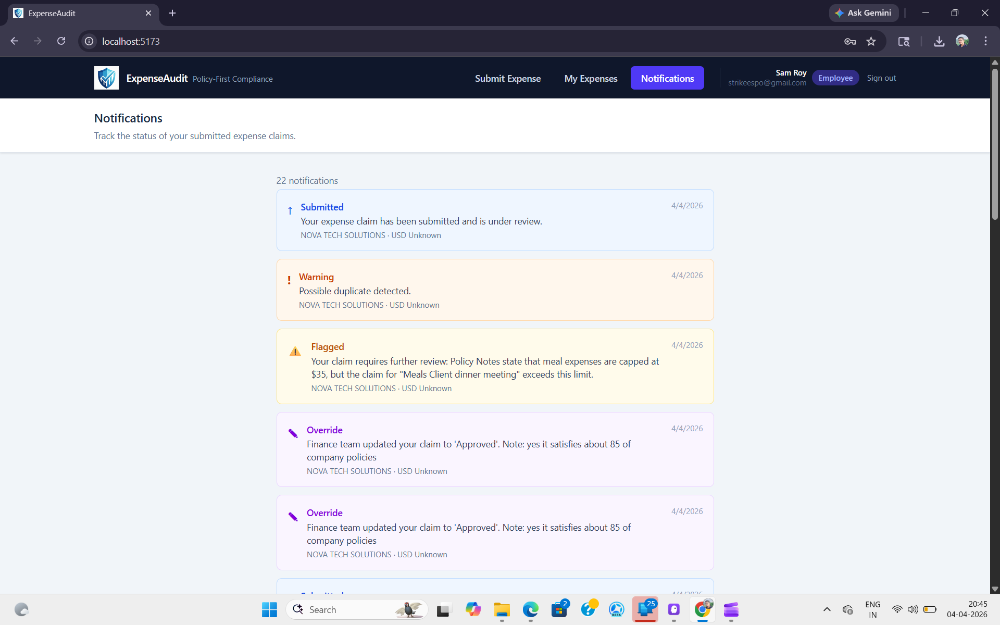
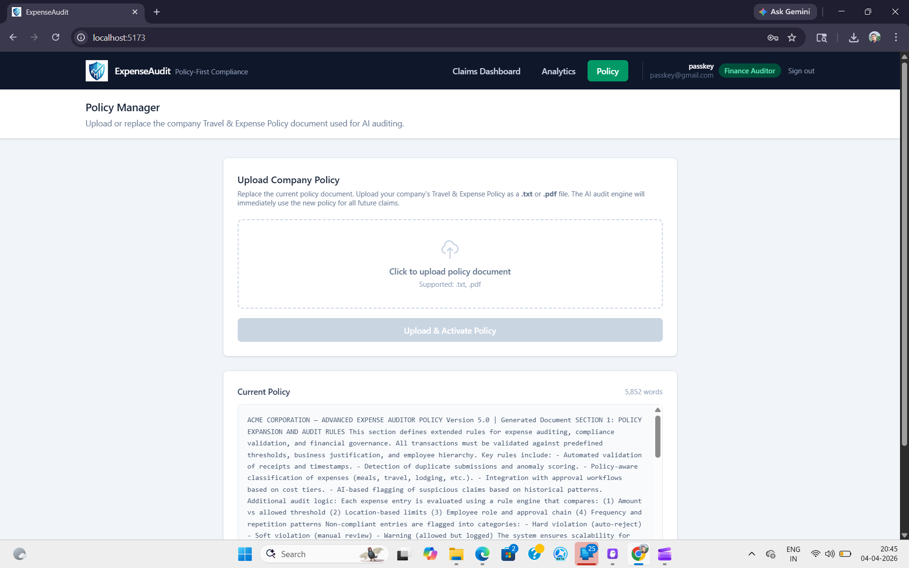

# ExpenseAudit — Policy-First Expense Auditor

---

## The Problem

Corporate finance teams manually cross-reference every employee expense receipt against a 40+ page Travel & Expense Policy — a process that is slow, inconsistent, and error-prone. Spending limits vary by location and seniority, policy language is ambiguous, and high receipt volumes create 3-week reimbursement backlogs, resulting in "Spend Leakage" where non-compliant claims slip through undetected.

---

## The Solution

ExpenseAudit is an AI-powered expense compliance platform that simultaneously reads a receipt and the company policy to automatically audit every claim — with zero manual cross-referencing. Employees upload receipts (JPG, PNG, PDF), provide a business justification, and receive an instant Approved / Flagged / Rejected decision with a one-sentence explanation citing the specific policy rule. Finance auditors get a risk-sorted dashboard, override capability, spend analytics, and the ability to hot-swap the company policy document at any time.

---

## Video Demo

> 🎬 [Watch the Demo on Google Drive](https://drive.google.com/file/d/1wdHV3wA71JvMsY6pGFW5UR169nzWMb05/view?usp=drive_link)

---

## Screenshots

### Role Selection — Landing Page


### Employee Login


### Submit Expense Claim


### Audit Result


### Finance Dashboard


### Audit Detail View (Timeline + Policy Snippet)


### Spend Analytics


### My Expenses (Employee View)


### Notifications


### Policy Manager


---

## Overview

Corporate expense auditing is a high-stakes, repetitive process. Finance teams spend hours cross-referencing receipts against multi-page policy documents, leading to backlogs, inconsistency, and non-compliant claims slipping through.

This platform solves that by combining **OCR receipt extraction**, **policy-aware RAG retrieval**, and **LLM-based auditing** into a single end-to-end workflow. Every claim is evaluated against the company's Travel & Expense Policy in real time, with a clear decision and a cited policy reason — no human bottleneck required.

---

## Features

### Role-Based Access
- Dark landing page with role selector on first load
- **Firebase Email/Password authentication** — employees and auditors sign in with their own account
- **Employee** view: Submit Expense, My Expenses, Notifications
- **Finance Auditor** view: Claims Dashboard, Analytics, Policy Manager
- Role badge and user email shown in navbar with sign out button
- Claims and notifications are scoped per user — employees only see their own data

### Employee Portal
- Upload receipts as **JPG, PNG, or PDF**
- Employee name pre-filled from Firebase account (editable)
- Provide a business justification and expense date
- Receive an instant audit decision: **Approved**, **Flagged**, or **Rejected**
- Automatic date consistency check (claimed date vs. receipt date)
- Image quality validation (blur detection)
- **Email notification** sent automatically to the employee's registered email on every decision

### AI Audit Engine
- OCR extracts **Merchant Name**, **Date**, **Amount**, and **Currency** from receipts
- Policy document is chunked and searched using keyword-based RAG
- LLM (Groq LLaMA 3.3 70B) evaluates the claim against the most relevant policy sections
- Returns a decision with a **one-sentence explanation citing the specific policy rule**
- **Expense category auto-detection**: classifies each claim as Meals, Travel, Lodging, Equipment, etc.
- **Compliance score**: 0–100 score per claim indicating degree of policy adherence
- Risk scoring: **Low / Medium / High**
- **Duplicate detection**: flags claims with matching merchant, amount, and date from the same employee

### Finance Dashboard
- Table of all claims sorted by **risk level** (High → Medium → Low)
- Summary cards: Total, Approved, Flagged, Rejected
- Columns include **category tag** and **compliance score** per claim
- Duplicate warning badge on suspicious claims
- **Override** any AI decision with a custom comment
- Click any claim to open the **Audit Detail View**

### Policy Manager (Finance Auditor)
- Upload a new company policy as a **.txt or .pdf** file directly from the UI
- PDF text is automatically extracted using pdfplumber
- New policy takes effect immediately for all future audits — no restart needed
- Preview the current active policy with word count

### Spend Analytics
- KPI cards: total claims, average compliance score, high-risk count, duplicate count
- Three interactive **pie charts**: claims by decision, by expense category, and by risk level
- Percentage labels on each slice with hover tooltips showing exact counts
- Live data from all submitted claims

### My Expenses (Employee View)
- Auto-loads the logged-in employee's personal claim history — no name search needed
- Shows category, compliance score, duplicate flag, and audit reason per claim
- Direct link to the full audit detail view for each claim

### Audit Detail View
- Side-by-side layout: Receipt image | Extracted OCR data | Policy snippet + AI decision
- **Visual audit trail timeline**: Submitted → Under Review → Decision → Overridden with coloured step indicators
- Shows the exact policy section the AI used to make its decision
- Displays date warnings and image quality flags
- PDF receipts open in a new tab; images render inline

### Notifications
- Auto-loads all status updates for the logged-in employee
- Timestamped updates for every stage: Submitted, Approved, Flagged, Rejected, Overridden
- **Email notifications** sent via EmailJS SMTP to the employee's registered email on every decision and override

---

## Tech Stack

| Layer | Technology |
|---|---|
| Frontend | React 19, TypeScript, Tailwind CSS v4, Vite 5, Recharts |
| Backend | Python 3.14, FastAPI, Uvicorn |
| Auth | Firebase Email/Password Authentication |
| Email | EmailJS (SMTP via Gmail) |
| OCR | Pytesseract + Pillow + pdf2image |
| LLM | Groq API — LLaMA 3.3 70B Versatile |
| Policy RAG | Keyword-based chunk retrieval (no vector DB) |
| Storage | Google Firestore (NoSQL cloud database) |

---

## Project Structure
```
expenseauditor/
├── backend/
│   ├── app.py              # FastAPI routes: /upload, /claims, /override, /notifications, /analytics, /my-claims
│   ├── ocr.py              # OCR extraction, blur detection, PDF conversion
│   ├── llm.py              # Groq LLM audit — decision, reason, category, compliance score
│   ├── policy_engine.py    # Policy chunking and keyword-based RAG retrieval
│   └── requirements.txt
│
├── data/
│   ├── policy.txt          # Active company T&E policy document (replaceable via UI)
│   ├── serviceAccountKey.json  # Firebase service account key (not committed)
│   └── images/             # Uploaded receipt files
│
├── frontend/
│   └── src/
│       ├── App.tsx
│       ├── firebase.ts             # Firebase auth configuration
│       ├── lib/
│       │   └── sendEmail.ts        # EmailJS email notification utility
│       └── components/
│           ├── RoleSelect.tsx      # Dark landing page with employee / auditor role selector
│           ├── Login.tsx           # Firebase email/password sign in + sign up
│           ├── Upload.tsx          # Employee submission portal with how-it-works panel
│           ├── Dashboard.tsx       # Finance overview table with category + score columns
│           ├── ClaimDetail.tsx     # Audit trail timeline + side-by-side detail view
│           ├── SpendAnalytics.tsx  # Pie charts: by decision, category, risk
│           ├── MyExpenses.tsx      # Employee personal claim history (auth-scoped)
│           └── Notifications.tsx  # Employee status update inbox (auth-scoped)
│
├── expense/                # Python virtual environment
├── .env.local              # API keys (not committed)
├── APPROACH.md             # Solution design document
└── README.md
```

---

## Prerequisites

Before running the project, ensure the following are installed:

- **Python 3.10+** — [python.org](https://www.python.org/)
- **Node.js 18+** — [nodejs.org](https://nodejs.org/)
- **Tesseract OCR** — [Windows installer](https://github.com/UB-Mannheim/tesseract/wiki)
- **Poppler** (for PDF support) — [Windows binaries](https://github.com/oschwartz10612/poppler-windows/releases)
- **Groq API key** (free) — [console.groq.com](https://console.groq.com/keys)
- **Firebase project** with Email/Password auth enabled and **Firestore** database created — [console.firebase.google.com](https://console.firebase.google.com)
- **EmailJS account** with SMTP service configured — [emailjs.com](https://www.emailjs.com)

---

## Setup & Installation

### 1. Clone the repository
```bash
git clone https://github.com/AdwinTS/ExpenseAudit.git
cd expense-auditor
```

### 2. Create and activate the Python virtual environment
```bash
python -m venv expense
# Windows
expense\Scripts\activate
```

### 3. Install backend dependencies
```bash
pip install -r backend/requirements.txt
```

### 4. Configure paths and API key

Open `backend/ocr.py` and set your Tesseract and Poppler paths:
```python
pytesseract.pytesseract.tesseract_cmd = r"C:\Program Files\Tesseract-OCR\tesseract.exe"
POPPLER_PATH = r"C:\poppler\Library\bin"
```

Create a `frontend/.env.local` file inside the frontend folder:
```env
VITE_FIREBASE_API_KEY=your_firebase_api_key
VITE_FIREBASE_AUTH_DOMAIN=your_project.firebaseapp.com
VITE_FIREBASE_PROJECT_ID=your_project_id
VITE_FIREBASE_APP_ID=your_app_id
VITE_STORAGE_BUCKET=your_project.firebasestorage.app
VITE_MESSAGING_SENDER_ID=your_sender_id
VITE_EMAILJS_SERVICE_ID=service_xxxxxxx
VITE_EMAILJS_TEMPLATE_ID=template_xxxxxxx
VITE_EMAILJS_PUBLIC_KEY=your_emailjs_public_key
```

Create a `.env.local` file in the project root:
```env
GROQ_API_KEY=your_groq_api_key_here
```

Place your Firebase service account key at:
```
data/serviceAccountKey.json
```
Download it from Firebase Console → Project Settings → Service Accounts → Generate new private key.
### 5. Install frontend dependencies
```bash
cd frontend
npm install
```

---

## Running the Application

Open two terminals:

**Terminal 1 — Backend**
```bash
cd backend
uvicorn app:app --reload --port 8000
```

**Terminal 2 — Frontend**
```bash
cd frontend
npm run dev
```

Then open [http://localhost:5173](http://localhost:5173) in your browser.

The API is available at [http://localhost:8000](http://localhost:8000) — visit [http://localhost:8000/docs](http://localhost:8000/docs) for the interactive Swagger UI.

---

## API Reference

| Method | Endpoint | Description |
|---|---|---|
| `POST` | `/upload` | Submit a receipt for OCR + AI audit |
| `GET` | `/claims` | Retrieve all claims, sorted by risk |
| `GET` | `/claims/{id}` | Get a single claim by ID |
| `POST` | `/override` | Override an AI decision with a custom note |
| `GET` | `/notifications/{user_id}` | Get all status updates for a user (by Firebase UID) |
| `GET` | `/my-claims/{user_id}` | Get all claims submitted by a user (by Firebase UID) |
| `GET` | `/analytics` | Aggregated stats: by decision, category, risk, avg score |

---

## How the Audit Works
```
Employee uploads receipt
        ↓
OCR extracts: Merchant, Date, Amount, Currency + blur/quality check
        ↓
Duplicate detection: checks for same merchant + amount + date from same employee
        ↓
Policy document is chunked into paragraphs
        ↓
Top 4 most relevant chunks retrieved via keyword matching
        ↓
LLM receives: policy chunks + receipt text + business purpose
        ↓
LLM returns: Decision + Reason (citing policy rule) + Risk + Category + Compliance Score
        ↓
Claim saved with full audit trail + notifications generated
        ↓
Finance dashboard sorted by risk · Analytics updated · Employee notified
```

---

## Environment Variables

| Variable | Location | Description |
|---|---|---|
| `GROQ_API_KEY` | `.env.local` (root) | Groq API key for LLaMA 3.3 inference |
| `VITE_FIREBASE_API_KEY` | `frontend/.env.local` | Firebase project API key |
| `VITE_FIREBASE_AUTH_DOMAIN` | `frontend/.env.local` | Firebase auth domain |
| `VITE_FIREBASE_PROJECT_ID` | `frontend/.env.local` | Firebase project ID |
| `VITE_FIREBASE_APP_ID` | `frontend/.env.local` | Firebase app ID |
| `VITE_EMAILJS_SERVICE_ID` | `frontend/.env.local` | EmailJS SMTP service ID |
| `VITE_EMAILJS_TEMPLATE_ID` | `frontend/.env.local` | EmailJS template ID |
| `VITE_EMAILJS_PUBLIC_KEY` | `frontend/.env.local` | EmailJS public key |

---

## Notes

- Claims are stored in **Google Firestore** — no local database setup required.
- Receipt images are stored locally in `data/images/`.
- The policy document (`data/policy.txt`) can be replaced via the Finance Auditor's Policy Manager tab, or by uploading a PDF/TXT directly.
- `data/serviceAccountKey.json` is required for the backend to connect to Firestore — never commit this file.
- This project is designed for hackathon and demo use. For production, add proper role-based Firestore security rules and server-side auth verification.

---

## License

MIT License — free to use, modify, and distribute.
